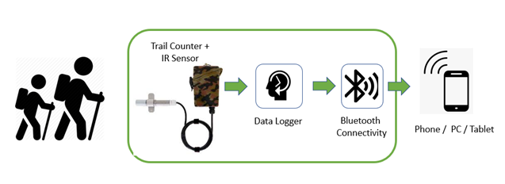

## Title: 
Next-Generation systems for Park Data collection

### Authors: 
John Price, Jason Pitts

### Abstract: 

Recent advances in low power wireless technologies have enabled simple, high-speed connectivity to sensors used for gathering environmental data. Much of the currently deployed sensor infrastructure in the park system, however, is not designed to support wireless connectivity. As a result, park staff are required to visit each sensor site and make manual connections to devices to download data for applications like trail use monitoring. Sometimes these sensors are in areas with rugged terrain, adding to the difficulty in extracting the information and even increased safety risk. We propose to explore adding a low-power wireless link, (Bluetooth Low Energy, WiFi and LoRAWAN) to novel environmental sensors to allow ‘touchless’ access to this information. 

### Technical Approach: 
The need for accurate statistics around the use of our recreation areas has been well appreciated for some time:

“Every manager of a recreation site needs three essential statistics: man-hours of use, number of visits, and peak loads.” (James and Ripley,1963) [[1](https://github.com/digamesystems/LIDAR/blob/main/docs/Reference/rp_se003.pdf)]

In trail utilization applications, these statistics are often gathered by infrared detectors tied to a microprocessor-controlled counter with memory that logs the data as a function of time. One popular system of this type is made by TRAFX Research Ltd. [[2](https://www.trafx.net/about)]. We propose to add a combination of WiFi, Bluetooth and LoRaWAN connectivity to the system to enable ‘touchless’ downloading of information from the device’s memory when a researcher is near. 
 
Other applications include Vehicle counting to better understand Park Visitation statistics.

*Figure 1.* Proposed System

A working prototype will be developed to allow the exploration of: 
- Power and cost limitations for a next generation system
- Wireless performance under various conditions including range, connection speed and reliability
- New sensor technologies like LIDAR that might eliminate the drawbacks of current "On Road" sensor solutions
- Environmental requirements 
- User experience and UI design 
- Impact of ‘touchless’ downloads on system reliability
- How this capability might improve the quality of research data.
  
The project would also serve as a learning platform for the student intern community, offering opportunities in electrical, mechanical and software engineering.

### References: 
[[1](https://github.com/digamesystems/LIDAR/blob/main/docs/Reference/rp_se003.pdf)] - Instructions for Using Traffic Counters to Estimate Recreation Visits and Use George A. James; Thomas H. Ripley, Res. Pap. SE-3. Asheville, NC: U.S. Department of Agriculture, Forest Service, Southeastern Forest Experiment Station. 14 p. (1963).

[[2](https://www.trafx.net/about)] – TRAFX Research Ltd. 
